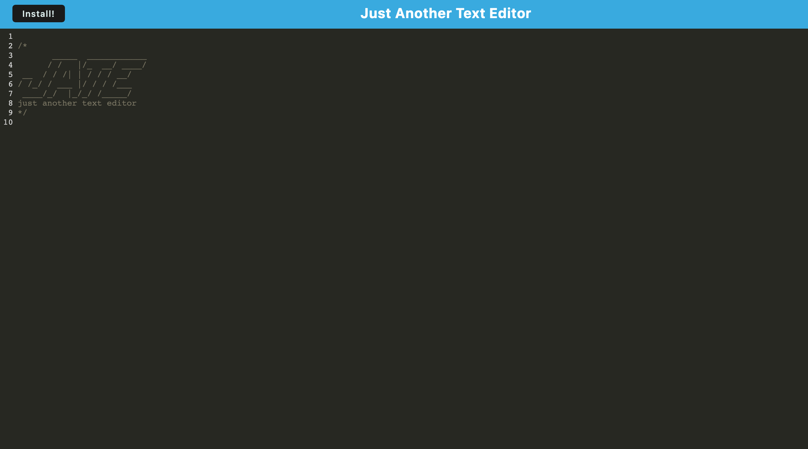

# Text Editor

## Description
A progressive web application consisting of a text editor built with Node.js, Express, Webpack, IndexedDB and Workbox. Users have offline capabilities - the application can be installed and run locally on a user's device.

## License  
This application is covered under the following license. Please review the link below for additional information pertaining to the license.
    
  
https://opensource.org/licenses/MIT

## Table of Contents
[Deployed Application](#deployed-application)  
[Built With](#built-with)  
[Landing Page](#landing-page)  
[Installation](#installation)  
[Contribution](#contribution) 

## Deployed Application
https://text-editor-dch.herokuapp.com/

## Built With
* Node.js
* Express.js
* Webpack
* IndexedDB
* Workbox
* Concurrently
* Babel
* HTML
* CSS
* Bootstrap
* Git
* Heroku

## Landing Page

## Installation  
To run locally once cloned:
* Enter `npm install` in the CLI to install the required npm packages
* Enter `npm start` in the CLI to launch the application

## Contribution
Built by Dylan Hay